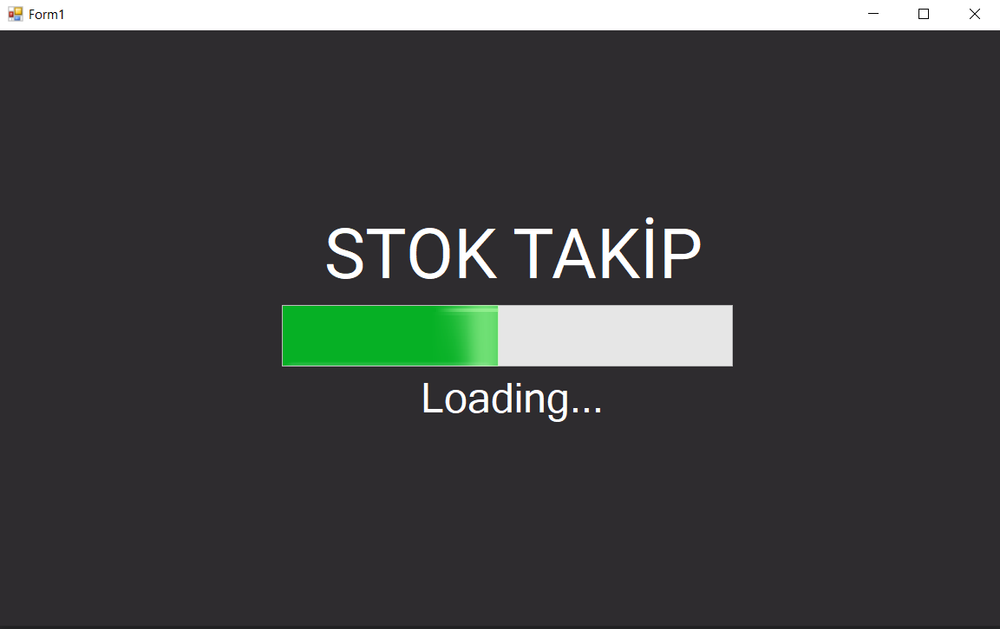
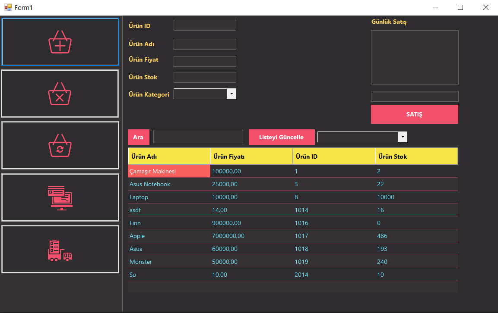
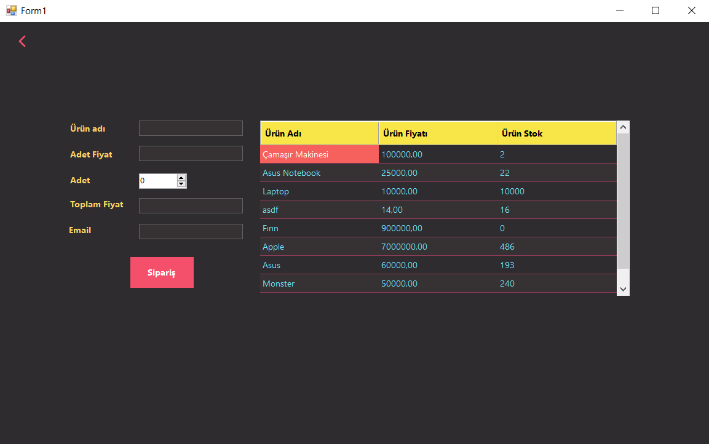

# Inventory Automation System / Envanter Otomasyon Sistemi

This is a Windows Forms-based Inventory Automation System developed in C#.  
It allows users to manage product stock, monitor sales, and visualize data through reports and charts.

Bu proje, C# ile geliştirilmiş Windows Forms tabanlı bir Envanter Otomasyon Sistemidir.  
Kullanıcıların ürün stoklarını yönetmesine, satışları takip etmesine ve verileri grafiklerle görselleştirmesine olanak sağlar.

---

## 🛠 Technologies Used / Kullanılan Teknolojiler

- C# (Windows Forms)
- SQL Server (Database)
- ADO.NET (Data Access)
- Entity Framework 6.2.0
- LiveCharts 0.9.7 (for charting)
- LiveCharts.WinForms / LiveCharts.Wpf

---

## 🔑 Features / Özellikler

- Add / update / delete products  
  Ürün ekleme / güncelleme / silme   
- Daily sales visualization with charts  
  Günlük satışların grafiklerle gösterimi  
- Order and supplier email notification system  
  Sipariş ve tedarikçi e-posta bilgilendirme sistemi  
- Simple, user-friendly interface  
  Basit ve kullanıcı dostu arayüz

---

## 🖼️ Screenshots / Ekran Görüntüleri

### Opening Screen / Açılış Ekranı  
The opening screen of the application.  
Uygulamanın açılış ekranı.  

### Main Dashboard View / Ana Gösterge Paneli Görünümü  
Overview of sales, orders, and reports.  
Satışların, siparişlerin ve raporların genel görünümü.  

### Order Placed Screen / Sipariş Verildi Ekranı  
Confirmation screen shown after placing an order.  
Sipariş verildikten sonra gösterilen onay ekranı.  

### Sales Orders Screen / Satış ve Siparişler Ekranı  
Detailed dashboard with sales and order charts.  
Satış ve sipariş grafiklerinin detaylı gösterildiği panel.  

